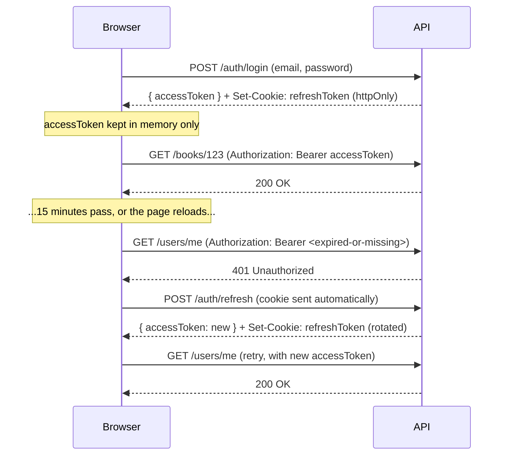
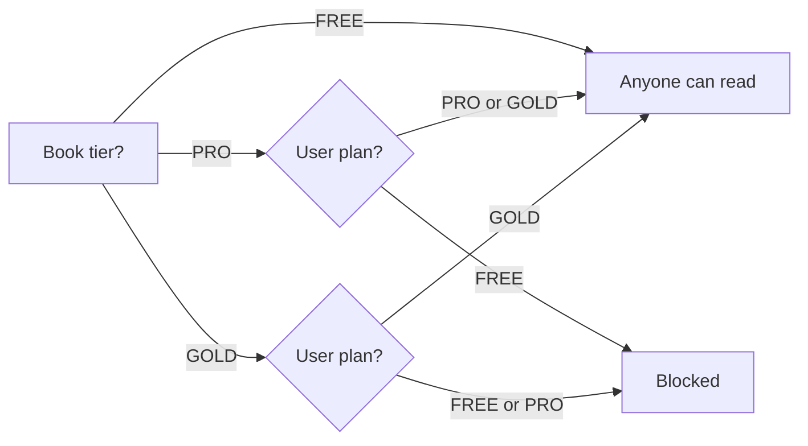
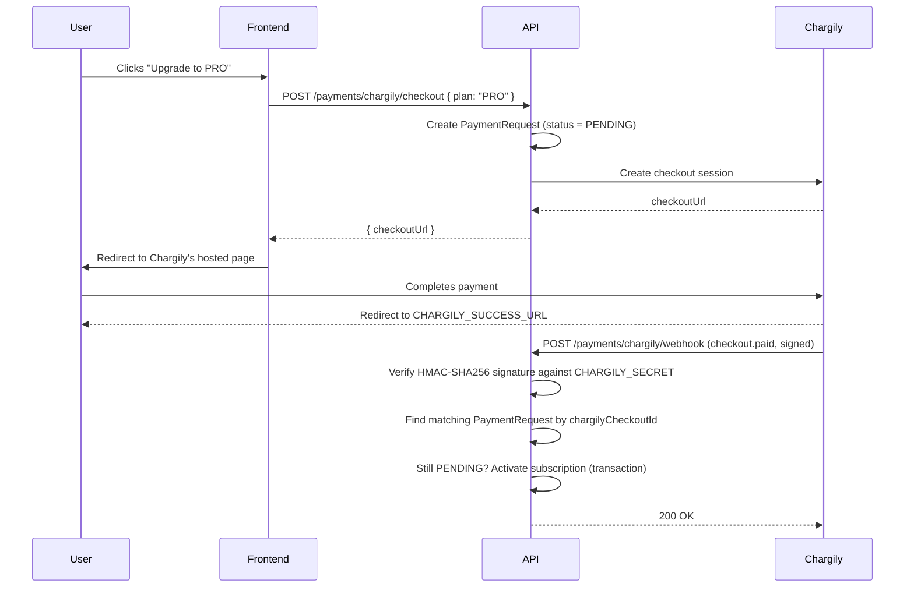

# Architecture

This explains, in plain language, the three trickiest pieces of the system:
how login works without ever storing a token in the browser, how a book
decides who's allowed to read it, and how a payment on Chargily's site turns
into an active subscription on ours.

## 1. Login and staying logged in

The goal: keep the user logged in across page reloads, without ever putting
a usable login token somewhere a malicious script on the page could steal it
(no `localStorage`, no `sessionStorage`).

The trick is splitting the session into two tokens with very different
lifetimes and storage:

- **Access token** — short-lived (15 minutes), sent as `Authorization: Bearer
  <token>` on every API call. Kept in a plain JavaScript variable in the
  frontend. It disappears the instant the page reloads — that's fine, by
  design.
- **Refresh token** — long-lived (7 days), stored **only** as an `httpOnly`
  cookie. JavaScript can never read it; the browser just attaches it
  automatically to requests to `/api/auth/*`.

This whole retry dance happens inside one function —
[`api()` in `apps/frontend/src/lib/api.ts`](../apps/frontend/src/lib/api.ts).
Every API call in the app goes through it, so no component has to think
about tokens at all: call `api('/books/123')`, and if the access token was
stale, it transparently refreshes and retries once before giving up.

On the server, [`AuthService.refresh()`](../apps/api/src/auth/auth.service.ts)
**rotates** the refresh token on every use — the old one is deleted from the
`RefreshToken` table and a new one issued. If a stolen refresh token is ever
replayed after the real user has already refreshed, it will have already
been deleted and the replay fails.

`JwtStrategy` re-loads the full `User` row from the database on *every*
request rather than trusting the token's embedded role/plan. That means a
role or subscription change (e.g. an admin promoting a user, or a payment
just landing) takes effect on the user's very next request, not up to 15
minutes later.

Changing a password (`/auth/reset-password`) deletes **all** of that user's
refresh tokens as a side effect, forcing re-login on every device.

## 2. Who can read which book (tiered access)

Books and users both carry a plan: `FREE`, `PRO`, or `GOLD`. One function is
the single source of truth for whether a user can open a given book —
[`canAccess()` in `apps/api/src/books/access.util.ts`](../apps/api/src/books/access.util.ts):

Admins bypass this check entirely — that's handled by the caller, not inside
`canAccess()` itself.

This one function is called from three places, each protecting something
different:

1. **`GET /books`** (the list) — never includes `indexURL` (the real content
   URL) for *anyone*, entitled or not. The list is just metadata.
2. **`GET /books/:id`** (one book's details) — strips `indexURL` out of the
   response if the requester isn't entitled, so the frontend can still show
   the book's cover/description/price without leaking where the actual
   content lives.
3. **`GET /books/:id/read`** (the reader) — this is the only endpoint that
   ever fetches and serves the real book content. Three checks happen in
   order before anything is returned: the `Referer` header must match the
   configured frontend origin (defense-in-depth against the URL being hit
   directly), the user must be logged in (`JwtAuthGuard`), and
   `canAccess()` must pass. Only then does the API fetch `indexURL`
   server-side and stream the HTML back — the browser never sees the
   original content URL, only the API's proxied response with a `<base>`
   tag and an anti-framing/anti-context-menu script injected. (That
   injected script is a deterrent for casual right-click-save/embedding,
   not real DRM — a determined user with dev tools could still get around
   it.)

## 3. Subscriptions and Chargily payments

Chargily hosts the actual checkout page — the API never touches card
details. The two systems stay in sync through a webhook.

A few details that matter:

- The webhook has **no login guard** — Chargily can't send a JWT — so the
  HMAC-SHA256 signature check (comparing with a timing-safe `timingSafeEqual`,
  not `===`, to avoid leaking timing information) is the *only* thing
  standing between this endpoint and anyone on the internet who wants to
  fake a "payment succeeded" call. It's exempt from rate limiting
  (`@SkipThrottle()`) since Chargily, not a browser, is the caller.
- It's **idempotent**: the handler looks up the `PaymentRequest` by
  `chargilyCheckoutId` and only acts if it's still `PENDING`. If Chargily
  retries the same webhook delivery (which webhook systems commonly do),
  the second call is a no-op instead of double-activating or
  double-charging anything.
- On `checkout.paid`, the user's `isSubscribed`, `subscriptionPlan`, and
  `subscriptionEndDate` (+1 month) are all updated together inside one
  database transaction — either all of it lands or none of it does.
- On failure events (`checkout.failed` / `checkout.canceled` /
  `checkout.expired`), the request is marked `REJECTED` and the user's
  `subscriptionStatus` resets to `REJECTED` too, so the frontend stops
  showing a stuck "payment pending" state instead of leaving the user
  wondering what happened.
- The `fullName` on a payment always comes from the authenticated user's own
  database record (`req.user.fullName`), never from the request body — so
  there's no way to submit a payment under someone else's name.

## Where this lives in code

| Concept | File |
|---|---|
| Token issuing/rotation | [`apps/api/src/auth/auth.service.ts`](../apps/api/src/auth/auth.service.ts) |
| Frontend refresh-and-retry logic | [`apps/frontend/src/lib/api.ts`](../apps/frontend/src/lib/api.ts) |
| Tier access rule | [`apps/api/src/books/access.util.ts`](../apps/api/src/books/access.util.ts) |
| Book list/detail gating | [`apps/api/src/books/books.service.ts`](../apps/api/src/books/books.service.ts) |
| Webhook signature check + activation | [`apps/api/src/payments/chargily.service.ts`](../apps/api/src/payments/chargily.service.ts) |

For the full list of routes these pieces sit behind, see [`API.md`](API.md).
